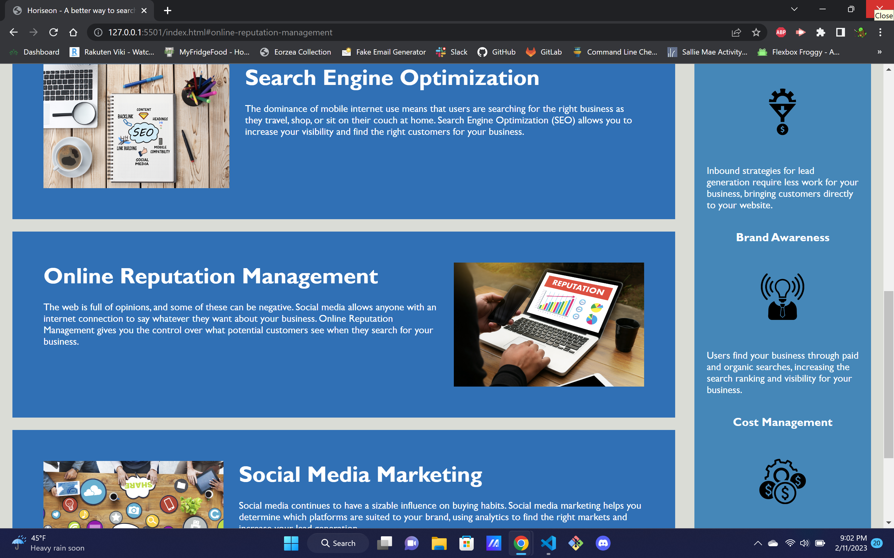

# Horiseon

## Search Engine Optimization

I first recieved this website needing to optimize the code for search engine results. Through this project, i learned to not repeat code by short abbreviations, as well as the importance of <class> and <content>. i added alt tags to all the pictures to improve accesability and added content in the meta data for all the key searchable items on this page. i also learned through this that images can be used through CSS as well as HTML and will definatly use that in future projects. 

In the future i would like to add code in CSS to make the website more friendly on mobile devices and accomodating on any browser.

website can be found at https://philrug.github.io/first-week-homework/ 